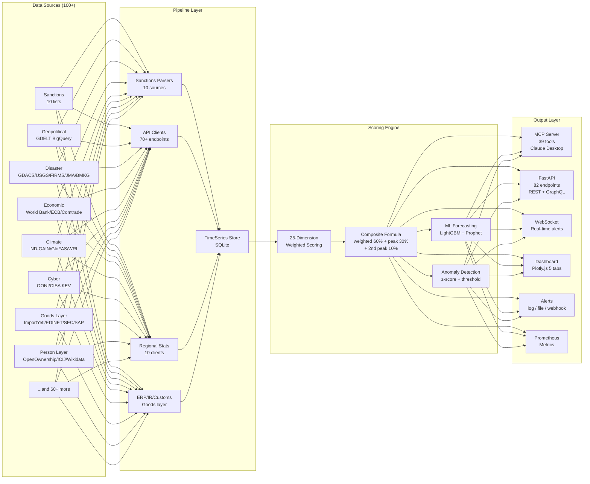

<!-- markdownlint-disable MD033 MD041 -->
<div align="center">

# SCRI Platform -- Supply Chain Risk Intelligence


**25-Dimension Risk Scoring x 100+ Data Sources x Knowledge Graph x ML Forecasting**

*Passive Risk Detection | Zero Questionnaires | MCP + REST + GraphQL + WebSocket*

[Quick Start](#quick-start) | [MCP Tools](#mcp-tools-43) | [API Endpoints](#api-endpoints-83) | [Data Sources](#data-sources-100) | [Architecture](#architecture) | [日本語](#日本語セクション)

</div>

---

## 30-Second Demo

```bash
# 1. Start the server
uvicorn api.main:app --port 8000

# 2. Screen a company against 10 sanctions lists -- takes ~2 seconds
curl -s -X POST http://localhost:8000/api/v1/screen \
  -H "Content-Type: application/json" \
  -d '{"company_name": "Huawei Technologies", "country": "China"}' | python -m json.tool

# Result: BIS Entity List match (95%), export license required
```

No questionnaires. No surveys. No waiting weeks for vendor responses.
SCRI pulls data from **100+ open sources** in real time and scores risk across **24 dimensions** -- in minutes, not months.

---

## Why SCRI Over Commercial SaaS

| Capability | Resilire / Riskethods / D&B | SCRI Platform |
|---|---|---|
| **Data collection** | Questionnaires & surveys (weeks) | Fully automated, passive (minutes) |
| **Risk dimensions** | 5-10 typical | **24 dimensions** |
| **Data sources** | Proprietary / opaque | **100+ open sources**, fully auditable |
| **Scoring transparency** | Black box | Open formula with weight breakdown |
| **Sanctions coverage** | 1-3 lists | **10 lists** (OFAC/EU/UN/METI/BIS/OFSI/SECO/Canada/DFAT/MOFA) |
| **Person Layer (UBO/PEP)** | Separate add-on ($$$) | Built-in (OpenOwnership/ICIJ/Wikidata) |
| **Cost** | $50k-500k/year | **Free & open-source** |
| **Customization** | Limited | Full control over weights, dimensions, thresholds |
| **AI Integration** | Separate product | Native **MCP server** for Claude/LLM |
| **Japan-specific data** | Minimal | BOJ, e-Stat, METI, MOFA, JMA built in |
| **ML Forecasting** | Rare | LightGBM + Prophet ensemble with backtest |
| **Real-time alerts** | Email only | WebSocket + Webhook + Prometheus |

SCRI was built for procurement teams who need to **explain risk decisions to management with evidence** -- not just a number.

---

## Features

- **24-dimension real-time risk scoring** for 50+ countries
- **BOM-level supply chain risk analysis** (Tier-1/2/3 inference via UN Comtrade)
- **39 MCP tools** for Claude Desktop / LLM integration
- **82 REST API endpoints** with rate limiting, GraphQL, and WebSocket
- **Real-time sanctions screening** against 10 consolidated lists (OFAC/EU/UN/METI/BIS/OFSI/SECO/Canada/DFAT/MOFA)
- **Person Layer**: UBO chain screening, PEP detection, officer network analysis (OpenOwnership/ICIJ/Wikidata)
- **Goods Layer**: US Customs (ImportYeti), IR scraping (EDINET/SEC), SAP ERP, BACI trade data
- **ML-based risk forecasting** (LightGBM + Prophet ensemble with backtest validation)
- **Interactive dashboard** (Plotly.js, 5 tabs: Risk Map, Portfolio, Correlation, Time Series, Alerts)
- **Cost impact estimation** (5 disruption scenarios with 4-component financial breakdown)
- **Supplier reputation screening** via GDELT news analysis
- **Monte Carlo simulation** (VaR, confidence intervals, n=1000)

---

## Architecture



### Directory Structure

```
supply-chain-risk/
  api/
    main.py                      # FastAPI server (82 endpoints)
    rate_limiter.py              # In-memory sliding-window rate limiter
    graphql_schema.py            # GraphQL schema (Strawberry)
    websocket_alerts.py          # WebSocket real-time alert broadcaster
    middleware/sanitizer.py      # Input sanitization (SQL injection, XSS, path traversal)
    routes/
      batch.py                   # Batch risk scores & sanctions screening
      bom.py                     # BOM risk analysis endpoints (6 routes)
      webhooks.py                # Webhook management (register/list/delete)
  mcp_server/
    server.py                    # FastMCP server (39 tools)
    validators.py                # Input validation for MCP tools
  scoring/
    engine.py                    # 24-dimension scoring engine
    dimensions/                  # Climate, Cyber & Person dimension scorers
  pipeline/
    sanctions/                   # 10 sanctions parsers (OFAC/EU/UN/METI/BIS/OFSI/SECO/Canada/DFAT/MOFA)
    gdelt/                       # GDELT BigQuery geopolitical monitoring
    disaster/                    # GDACS, USGS, NASA FIRMS, JMA, BMKG
    maritime/                    # IMF PortWatch, AISHub, Lloyd's List
    conflict/                    # ACLED, SIPRI, Global Peace Index
    economic/                    # World Bank, IMF Fiscal, Frankfurter/ECB
    trade/                       # UN Comtrade, ImportYeti, BACI, EU Customs, Japan Customs
    health/                      # Disease.sh, OCHA FTS, ReliefWeb, WHO GHO
    food/                        # FEWS NET, WFP HungerMap
    weather/                     # Open-Meteo, NOAA typhoon, space weather
    climate/                     # ND-GAIN, GloFAS, WRI Aqueduct, Climate TRACE
    cyber/                       # OONI, CISA KEV, ITU ICT
    compliance/                  # FATF, TI CPI, WJP, Basel AML, V-Dem, INFORM
    aviation/                    # OpenSky Network
    energy/                      # FRED, EIA
    infrastructure/              # Cloudflare Radar, IODA, port congestion
    japan/                       # BOJ, e-Stat, ExchangeRate-API
    regional/                    # KOSIS, Taiwan, NBS China, Vietnam, Malaysia, Singapore, ASEAN, Eurostat, ILO, AfDB
    corporate/                   # Graph builder, Houjin, ICIJ, OpenOwnership, Wikidata, IR scraper
    erp/                         # SAP ERP connector (EKKO/EKPO/MARA/MARC)
    opensanctions/               # OpenSanctions graph client
    transport/                   # IATA cargo
  features/
    analytics/                   # Portfolio, correlation, benchmark, sensitivity, BOM, cost impact, tier inference
    route_risk/                  # 7-chokepoint route analysis
    concentration/               # HHI concentration analysis
    simulation/                  # Disruption scenario simulation
    timeseries/                  # TimeSeries store, scheduler, ensemble forecaster, forecast monitor
    reports/                     # DD report generation
    monitoring/                  # Anomaly detection, alerts, webhook dispatcher, Prometheus metrics
    screening/                   # Supplier reputation screening
    goods_layer/                 # Unified goods layer API
    graph/                       # Person-Company knowledge graph
    bulk_assess.py               # CSV bulk assessment
    commodity/                   # Commodity exposure analysis
  config/
    constants.py                 # Central constants (VERSION, DIMENSIONS, DATA_SOURCES, etc.)
    alert_config.yaml            # Alert thresholds and channels
    accepted_correlations.yaml   # Known acceptable correlations
    leading_indicators.yaml      # 16 leading indicator cross-correlations
  dashboard/
    index.html                   # Interactive Plotly.js dashboard (5 tabs)
  scripts/                       # Ingestion, diagnostics, benchmarks
  tests/                         # 31 tests (unit + integration + regression)
  data/                          # BOM samples, comtrade cache, timeseries DB
  docs/                          # OpenAPI spec, MCP catalog, API reference
  reports/                       # QA reports, stream completion reports
```

---

## Quick Start

### Docker

```bash
docker-compose up -d
# API: http://localhost:8000
# MCP: http://localhost:8001
# Dashboard: http://localhost:8000/dashboard
# GraphQL: http://localhost:8000/graphql
# WebSocket: ws://localhost:8000/ws/alerts
```

### Direct Install

```bash
git clone https://github.com/your-org/supply-chain-risk.git
cd supply-chain-risk
python3.11 -m venv .venv311
source .venv311/bin/activate
pip install -r requirements.txt

# 1. Ingest sanctions data (10 sources)
python scripts/ingest_sanctions.py

# 2. Set up timeseries database
python scripts/setup_timeseries_db.py

# 3. Start API Server (82 endpoints)
uvicorn api.main:app --reload --port 8000

# 4. Start MCP Server (39 tools, for Claude Desktop)
python mcp_server/server.py
# -> SSE transport on http://localhost:8001
```

### Environment Variables

| Variable | Description | Default | Required |
|---|---|---|---|
| `SQLITE_DB_PATH` | Path to TimeSeries SQLite database | `data/timeseries.db` | No |
| `SECO_CACHE_PATH` | Path to SECO sanctions disk cache | `data/seco_cache.pkl` | No |
| `SCORE_HISTORY_PATH` | Path to score history JSON | `data/score_history.json` | No |
| `ALERT_OUTPUT` | Alert output mode (log/file/both) | `log` | No |
| `FRED_API_KEY` | FRED API key for economic data | None | No |
| `COMTRADE_API_KEY` | UN Comtrade API key (higher rate limits) | None | No |
| `ACLED_EMAIL` | ACLED account email | None | No |
| `ACLED_KEY` | ACLED API key | None | No |
| `BIGQUERY_PROJECT` | Google Cloud project for GDELT | None | No |
| `WEBHOOK_URL` | Webhook callback URL | None | No |
| `WEBHOOK_SECRET` | HMAC-SHA256 webhook signing secret | None | No |

> All data sources work without API keys. Keys are optional and improve rate limits or enable additional sources.

### Configuration Files

| File | Description |
|---|---|
| `config/constants.py` | Central constants (VERSION, DIMENSIONS, DATA_SOURCES, PRIORITY_COUNTRIES) |
| `config/alert_config.yaml` | Alert thresholds and notification channels |
| `config/accepted_correlations.yaml` | Registry of accepted high-correlation dimension pairs |
| `config/leading_indicators.yaml` | 16 leading indicator cross-correlation configurations |

---

## Use Case Quick Start

### Procurement Manager: Screen New Supplier

```bash
# Screen against 10 sanctions lists
curl -s -X POST http://localhost:8000/api/v1/screen \
  -H "Content-Type: application/json" \
  -d '{"company_name": "Acme Corp", "country": "China"}'

# Get 24-dimension risk score
curl "http://localhost:8000/api/v1/risk/sup001?company_name=Acme+Corp&country=China"

# Generate due diligence report
curl -s -X POST http://localhost:8000/api/v1/dd-report \
  -H "Content-Type: application/json" \
  -d '{"entity_name": "Acme Corp", "country": "China"}'
```

### Supply Chain Manager: Analyze BOM Risk

```bash
# Upload BOM and get risk analysis with Tier-2/3 inference
curl -s -X POST http://localhost:8000/api/v1/bom/analyze \
  -H "Content-Type: application/json" \
  -d @data/bom_samples/ev_powertrain.json

# Estimate financial impact of disruption
curl -s -X POST http://localhost:8000/api/v1/cost-impact/estimate \
  -H "Content-Type: application/json" \
  -d '{"scenario": "conflict", "annual_spend_usd": 5000000, "duration_days": 90}'
```

### Compliance Officer: UBO / PEP Screening

```bash
# With Claude Desktop (MCP):
# "Acme Corpの実質的支配者チェーンをスクリーニングして"
# -> screen_ownership_chain("Acme Corp") を実行
# -> OpenOwnership/ICIJ/Wikidata から UBO・PEP・オフショアリーク情報を統合分析
```

### Data Analyst: Country Risk Comparison

```bash
# Compare 5 countries across 24 dimensions
curl "http://localhost:8000/api/v1/risk/cmp?company_name=compare&location=China"

# Interactive dashboard
open http://localhost:8000/dashboard
```

### Claude Desktop Configuration

```json
{
  "mcpServers": {
    "supply-chain-risk": {
      "command": "python",
      "args": ["mcp_server/server.py"],
      "cwd": "/path/to/supply-chain-risk"
    }
  }
}
```

---

## Data Sources (100+)

### Sanctions & Compliance (19)

| Source | Category | Coverage | Update Frequency | API Key |
|---|---|---|---|---|
| OFAC SDN | Sanctions | US sanctions | Daily | No |
| EU Consolidated List | Sanctions | EU sanctions | Daily | No |
| UN Security Council | Sanctions | Global sanctions | Daily | No |
| METI Foreign User List | Sanctions | Japan export control | Monthly | No |
| BIS Entity List | Sanctions | US export control | Monthly | No |
| UK OFSI | Sanctions | UK sanctions | Daily | No |
| Switzerland SECO | Sanctions | Swiss sanctions | Weekly | No |
| Canada DFATD | Sanctions | Canadian sanctions | Weekly | No |
| Australia DFAT | Sanctions | Australian sanctions | Weekly | No |
| Japan MOFA | Sanctions | Japan foreign policy | Monthly | No |
| OpenSanctions | Sanctions | Aggregated global | Daily | No |
| FATF | Compliance | AML/CFT ratings | Annual | No |
| TI CPI | Compliance | Corruption perception | Annual | No |
| WJP Rule of Law | Compliance | Judicial independence | Annual | No |
| Basel AML Index | Compliance | Money laundering risk | Annual | No |
| V-Dem | Compliance | Democracy index | Annual | No |
| INFORM Risk API | Compliance | Risk index (45K+ records) | Annual | No |
| Freedom House | Political | Freedom ratings | Annual | No |
| DoL ILAB / Global Slavery Index | Labor | Child/forced labor | Annual | No |

### Geopolitical & Conflict (6)

| Source | Category | Coverage | Update Frequency | API Key |
|---|---|---|---|---|
| GDELT BigQuery | Geopolitical | Global events | Real-time | Yes (GCP) |
| ACLED | Conflict | Armed conflict | Weekly | Yes (free) |
| SIPRI | Conflict | Military expenditure | Annual | No |
| Global Peace Index | Conflict | Peace rankings | Annual | No |
| GDELT v2 Article Search | Reputation | News sentiment | Daily | No |
| ILO (ILOSTAT) | Labor | Global labor stats | Quarterly | No |

### Disaster & Weather (7)

| Source | Category | Coverage | Update Frequency | API Key |
|---|---|---|---|---|
| GDACS | Disaster | Global alerts | Real-time | No |
| USGS Earthquake | Disaster | Seismic activity | Real-time | No |
| NASA FIRMS | Disaster | Fire detection | Real-time | No |
| JMA | Disaster | Japan weather alerts | Real-time | No |
| BMKG | Disaster | Indonesia seismic | Real-time | No |
| Open-Meteo | Weather | Global forecasts | Hourly | No |
| NOAA NHC/SWPC | Weather | Cyclones & space weather | Real-time | No |

### Economic & Trade (12)

| Source | Category | Coverage | Update Frequency | API Key |
|---|---|---|---|---|
| World Bank | Economic | Macro indicators | Quarterly | No |
| IMF Fiscal Monitor | Economic | Fiscal data | Quarterly | No |
| Frankfurter/ECB | Economic | Exchange rates | Daily | No |
| UN Comtrade | Trade | Bilateral trade | Monthly | Optional |
| FRED | Economic | US indicators | Daily | Yes (free) |
| EIA | Energy | Energy markets | Daily | No |
| IEA/OWID | Energy | Import dependency | Annual | No |
| ImportYeti | Trade | US customs B/L | On-demand | No |
| BACI (CEPII) | Trade | Bilateral trade | Annual | No |
| EU Customs | Trade | EU trade data | Monthly | No |
| Japan Customs | Trade | Japan trade data | Monthly | No |
| ExchangeRate-API | Economic | FX rates | Daily | No |

### Maritime & Transport (6)

| Source | Category | Coverage | Update Frequency | API Key |
|---|---|---|---|---|
| IMF PortWatch | Maritime | Port disruptions | Daily | No |
| AISHub | Maritime | Ship tracking | Real-time | No |
| UNCTAD Port Stats | Maritime | Port congestion | Monthly | No |
| Lloyd's List | Maritime | Shipping data | Daily | No |
| OpenSky Network | Aviation | Air traffic | Hourly | No |
| IATA | Aviation | Air cargo | Monthly | No |

### Health & Humanitarian (6)

| Source | Category | Coverage | Update Frequency | API Key |
|---|---|---|---|---|
| Disease.sh | Health | Pandemic tracking | Real-time | No |
| OCHA FTS | Humanitarian | Funding gaps | Daily | No |
| ReliefWeb | Humanitarian | Crisis reports | Daily | No |
| WHO GHO | Health | Health indicators | Monthly | No |
| FEWS NET | Food | Famine early warning (IPC) | Monthly | No |
| WFP HungerMap | Food | Food security | Daily | No |

### Infrastructure & Cyber (5)

| Source | Category | Coverage | Update Frequency | API Key |
|---|---|---|---|---|
| Cloudflare Radar | Infrastructure | Traffic anomalies | Real-time | No |
| IODA | Infrastructure | Outage detection | Real-time | No |
| OONI | Cyber | Censorship probes | Weekly | No |
| CISA KEV | Cyber | Known vulnerabilities | Weekly | No |
| ITU ICT | Cyber | ICT development | Annual | No |

### Climate & Environment (4)

| Source | Category | Coverage | Update Frequency | API Key |
|---|---|---|---|---|
| ND-GAIN | Climate | Vulnerability index | Annual | No |
| GloFAS | Climate | Flood awareness | Real-time | No |
| WRI Aqueduct | Climate | Water risk atlas | Monthly | No |
| Climate TRACE | Climate | GHG emissions | Annual | No |

### Japan-Specific (3)

| Source | Category | Coverage | Update Frequency | API Key |
|---|---|---|---|---|
| BOJ | Japan Economy | Central bank stats | Daily | No |
| ExchangeRate-API | Japan Economy | JPY rates | Daily | No |
| e-Stat | Japan Economy | Government stats | Monthly | No |

### Regional Statistics (10)

| Source | Region | Update Frequency | API Key |
|---|---|---|---|
| KOSIS | South Korea | Monthly | No |
| Taiwan DGBAS | Taiwan | Monthly | No |
| China NBS | China | Quarterly | No |
| Vietnam GSO | Vietnam | Quarterly | No |
| DOSM Malaysia | Malaysia | Quarterly | No |
| MPA Singapore | Singapore | Monthly | No |
| ASEAN Stats | ASEAN region | Annual | No |
| Eurostat | Europe | Quarterly | No |
| ILO (ILOSTAT) | Global | Quarterly | No |
| AfDB | Africa | Annual | No |

### Corporate & ERP (10)

| Source | Category | Coverage | Update Frequency | API Key |
|---|---|---|---|---|
| EDINET | Corporate IR | Japan filings (有報) | Daily | No |
| SEC EDGAR | Corporate IR | US filings (10-K) | Daily | No |
| SAP ERP | ERP | Purchase orders | On-demand | Internal |
| Houjin Bangou | Corporate | Japan company registry | Daily | No |
| ICIJ Offshore Leaks | Corporate | Offshore entities | Periodic | No |
| OpenOwnership | Corporate | Beneficial ownership (UBO) | Daily | No |
| Wikidata | Corporate | Entity/person data | Real-time | No |
| SEC Conflict Minerals (SD) | Corporate | 3TG reports | Annual | No |
| OpenSanctions | Corporate | Entity graph | Daily | No |
| BACI (CEPII) | Trade | HS-level bilateral | Annual | No |

---

## MCP Tools (43)

The MCP server enables direct integration with Claude Desktop and other LLM-powered tools via the Model Context Protocol.

### Core Risk Assessment (1-9)

| # | Tool | Description |
|---|---|---|
| 1 | `screen_sanctions` | Screen entity against 10 consolidated sanctions lists |
| 2 | `monitor_supplier` | Register supplier for 15-min real-time monitoring |
| 3 | `get_risk_score` | 24-dimension risk score with evidence, forecast, history, explanations |
| 4 | `get_location_risk` | Location-based risk assessment (all 24 dimensions) |
| 5 | `get_global_risk_dashboard` | Global risk overview (disasters, typhoons, ports, health) |
| 6 | `get_supply_chain_graph` | Tier-N supply network graph visualization |
| 7 | `get_risk_alerts` | Recent risk alerts from monitoring |
| 8 | `bulk_screen` | CSV bulk sanctions screening |
| 9 | `compare_locations` | Multi-location risk comparison (up to 10 countries) |

### Route, Concentration & Simulation (10-16)

| # | Tool | Description |
|---|---|---|
| 10 | `analyze_route_risk` | Transport route risk (7 chokepoints, alternative routes) |
| 11 | `get_concentration_risk` | HHI supplier concentration analysis |
| 12 | `simulate_disruption` | Disruption scenario simulation (4 predefined scenarios) |
| 13 | `generate_dd_report` | KYS due diligence report generation |
| 14 | `get_commodity_exposure` | Sector commodity exposure analysis (6 sectors) |
| 15 | `bulk_assess_suppliers` | CSV bulk assessment (sanctions + 24-dim + concentration) |
| 16 | `get_data_quality_report` | Data quality & source health monitoring |

### Advanced Analytics (17-22)

| # | Tool | Description |
|---|---|---|
| 17 | `analyze_portfolio` | Multi-supplier portfolio analysis & clustering |
| 18 | `analyze_risk_correlations` | Dimension correlation matrix (Pearson/Spearman/Kendall) |
| 19 | `find_leading_risk_indicators` | Leading indicator detection (cross-correlation) |
| 20 | `benchmark_risk_profile` | Industry & peer benchmark comparison |
| 21 | `analyze_score_sensitivity` | Weight sensitivity ranking |
| 22 | `simulate_what_if` | What-If scenario simulation |

### Trend & Reporting (23-25)

| # | Tool | Description |
|---|---|---|
| 23 | `compare_risk_trends` | Multi-location risk trend comparison over time |
| 24 | `explain_score_change` | Root cause explanation for score changes between dates |
| 25 | `get_risk_report_card` | Executive-summary risk report card |

### BOM & Tier Inference (26-28)

| # | Tool | Description |
|---|---|---|
| 26 | `infer_supply_chain` | Tier-2/3 supply chain estimation via UN Comtrade |
| 27 | `analyze_bom_risk` | BOM supply chain risk analysis with bottleneck detection |
| 28 | `get_hidden_risk_exposure` | Hidden Tier-2/3 risk exposure analysis |

### Forecasting & Screening (29-30)

| # | Tool | Description |
|---|---|---|
| 29 | `get_forecast_accuracy` | ML forecast model accuracy metrics |
| 30 | `screen_supplier_reputation` | GDELT news-based reputation screening |

### Cost Impact (31-32)

| # | Tool | Description |
|---|---|---|
| 31 | `estimate_disruption_cost` | Financial impact estimation (4-component breakdown) |
| 32 | `compare_risk_scenarios` | All-scenario financial impact comparison |

### Goods Layer (33-36)

| # | Tool | Description |
|---|---|---|
| 33 | `find_actual_suppliers` | US customs data supplier verification (ImportYeti) |
| 34 | `build_supply_chain_from_ir` | IR-based supply chain graph (EDINET/SEC) |
| 35 | `get_conflict_minerals_status` | SEC conflict minerals (3TG) report |
| 36 | `analyze_product_complete` | Unified goods layer analysis (all data sources) |

### Person Layer (37-39)

| # | Tool | Description |
|---|---|---|
| 37 | `screen_ownership_chain` | UBO chain risk screening (OpenOwnership + sanctions/PEP/ICIJ) |
| 38 | `check_pep_connection` | PEP connection detection within N hops |
| 39 | `get_officer_network` | Officer network analysis (Wikidata/ICIJ offshore leaks) |

Full catalog with parameters & examples: [docs/MCP_TOOLS_CATALOG.md](docs/MCP_TOOLS_CATALOG.md)

---

## API Endpoints (83)

### Endpoint Categories

| Category | Count | Path Prefix | Methods |
|---|---|---|---|
| Health & Monitoring | 4 | `/health`, `/metrics`, `/api/v1/monitoring/quality`, `/ws/alerts` | GET, WS |
| Sanctions & Screening | 2 | `/api/v1/screen` | POST |
| Risk Scoring | 1 | `/api/v1/risk/{id}` | GET |
| Disaster & Weather | 5 | `/api/v1/disasters/`, `/api/v1/weather/` | GET |
| Maritime & Transport | 4 | `/api/v1/maritime/` | GET |
| Conflict | 1 | `/api/v1/conflict/` | GET |
| Economic & Trade | 4 | `/api/v1/economic/`, `/api/v1/currency/`, `/api/v1/trade/`, `/api/v1/energy/` | GET |
| Health & Humanitarian | 3 | `/api/v1/health/`, `/api/v1/humanitarian/`, `/api/v1/food-security/` | GET |
| Compliance & Political | 3 | `/api/v1/compliance/` | GET |
| Infrastructure & Cyber | 3 | `/api/v1/infrastructure/`, `/api/v1/climate/`, `/api/v1/cyber/` | GET |
| Japan Economy | 1 | `/api/v1/japan/economy` | GET |
| Global Dashboard | 1 | `/api/v1/dashboard/global` | GET |
| Alerts | 1 | `/api/v1/alerts` | GET |
| Monitoring | 2 | `/api/v1/monitor`, `/api/v1/monitors` | GET, POST |
| Statistics | 1 | `/api/v1/stats` | GET |
| Supply Chain Graph | 1 | `/api/v1/graph/{name}` | GET |
| Route Risk | 3 | `/api/v1/route-risk`, `/api/v1/chokepoints` | GET, POST |
| Concentration | 1 | `/api/v1/concentration` | POST |
| Simulation | 1 | `/api/v1/simulate/{scenario}` | GET |
| DD Reports | 1 | `/api/v1/dd-report` | POST |
| Commodity | 1 | `/api/v1/commodity/{sector}` | GET |
| Bulk Assessment | 1 | `/api/v1/bulk-assess` | POST |
| Analytics -- Portfolio | 3 | `/api/v1/analytics/portfolio` | POST |
| Analytics -- Correlation | 3 | `/api/v1/analytics/correlations` | GET, POST |
| Analytics -- Benchmark | 3 | `/api/v1/analytics/benchmark` | GET, POST |
| Analytics -- Sensitivity | 4 | `/api/v1/analytics/sensitivity` | POST |
| Analytics -- Overview | 1 | `/api/v1/analytics/overview` | GET |
| Forecasting | 3 | `/api/v1/forecast/` | GET |
| Reputation Screening | 2 | `/api/v1/screening/reputation` | POST |
| Cost Impact | 3 | `/api/v1/cost-impact/` | POST |
| BOM Analysis | 6 | `/api/v1/bom/` | GET, POST |
| Batch Operations | 2 | `/api/v1/batch/` | POST |
| Webhooks | 3 | `/api/v1/webhooks/` | GET, POST, DELETE |
| Dashboard & UI | 2 | `/dashboard`, `/` | GET |

Full OpenAPI specification: [docs/openapi_spec.yaml](docs/openapi_spec.yaml)

---

## Risk Dimensions (24)

### Scoring Formula

```
composite = weighted_sum * 0.6 + peak * 0.30 + second_peak * 0.10

if sanctions > 0 and sanctions < 100:
    composite += sanctions // 2
if sanctions == 100:
    overall = 100   # immediate override -- sanctioned entity
```

**Risk Levels**: CRITICAL (>=80) | HIGH (>=60) | MEDIUM (>=40) | LOW (>=20) | MINIMAL (<20)

### All 25 Dimensions

| # | Dimension | Key | Weight | Primary Data Source(s) | Update Freq |
|---|---|---|---|---|---|
| 1 | Sanctions | `sanctions` | Override | OFAC, EU, UN, METI, BIS, OFSI, SECO, Canada, DFAT, MOFA | Daily |
| 2 | Geopolitical | `geo_risk` | 0.07 | GDELT BigQuery | Real-time |
| 3 | Disaster | `disaster` | 0.07 | GDACS, USGS, NASA FIRMS, JMA, BMKG | Real-time |
| 4 | Legal | `legal` | 0.04 | WJP Rule of Law Index | Monthly |
| 5 | Maritime | `maritime` | 0.04 | IMF PortWatch, AISHub, UNCTAD | Daily |
| 6 | Conflict | `conflict` | 0.09 | ACLED | Weekly |
| 7 | Economic | `economic` | 0.06 | World Bank | Quarterly |
| 8 | Currency | `currency` | 0.04 | Frankfurter / ECB | Daily |
| 9 | Health | `health` | 0.04 | Disease.sh | Daily |
| 10 | Humanitarian | `humanitarian` | 0.03 | OCHA FTS, ReliefWeb | Daily |
| 11 | Weather | `weather` | 0.04 | Open-Meteo | Hourly |
| 12 | Typhoon / Space Wx | `typhoon` | 0.03 | NOAA NHC, NOAA SWPC | Real-time |
| 13 | Compliance | `compliance` | 0.06 | FATF, TI CPI | Annual |
| 14 | Food Security | `food_security` | 0.03 | FEWS NET IPC, WFP HungerMap | Monthly |
| 15 | Trade Dependency | `trade` | 0.05 | UN Comtrade | Monthly |
| 16 | Internet Infra | `internet` | 0.03 | Cloudflare Radar, IODA | Real-time |
| 17 | Political | `political` | 0.06 | Freedom House | Annual |
| 18 | Labor | `labor` | 0.03 | DoL ILAB, Global Slavery Index | Annual |
| 19 | Port Congestion | `port_congestion` | 0.04 | UNCTAD Port Statistics | Monthly |
| 20 | Aviation | `aviation` | 0.02 | OpenSky Network | Hourly |
| 21 | Energy | `energy` | 0.04 | FRED, EIA, IEA/OWID | Daily |
| 22 | Japan Economy | `japan_economy` | Info only | BOJ, ExchangeRate-API, e-Stat | Daily |
| 23 | Climate Risk | `climate_risk` | 0.05 | ND-GAIN, GloFAS, WRI Aqueduct, Climate TRACE | Monthly |
| 24 | Cyber Risk | `cyber_risk` | 0.04 | OONI, CISA KEV, ITU ICT | Weekly |

### Weight Categories

| Category | Weight | Dimensions |
|---|---|---|
| A: Sanctions, Conflict & Geopolitics | 28% | geo_risk (0.07), conflict (0.09), political (0.06), compliance (0.06) |
| B: Disaster, Infrastructure & Climate | 26% | disaster (0.07), weather (0.04), typhoon (0.03), maritime (0.04), internet (0.03), climate_risk (0.05) |
| C: Economic & Trade | 23% | economic (0.06), currency (0.04), trade (0.05), energy (0.04), port_congestion (0.04) |
| D: Cyber & Other | 23% | cyber_risk (0.04), legal (0.04), health (0.04), humanitarian (0.03), food_security (0.03), labor (0.03), aviation (0.02) |

> **Note**: Sanctions (dimension #1) is handled separately -- a confirmed sanctions match immediately overrides the score to 100. Japan Economy (dimension #22) is informational only for Japan-related assessments.

---

## Analytics Features

### Portfolio Analysis
- Multi-supplier risk ranking with weighted portfolio scores
- KMeans clustering to group suppliers by risk profile
- Geographic and sector concentration metrics

### Correlation Analysis
- 24x24 dimension correlation matrix (Pearson/Spearman/Kendall)
- Leading indicator detection via time-series cross-correlation
- Cascade pattern detection for risk propagation chains

### Benchmark Analysis
- 5 industry profiles: Automotive, Semiconductor, Pharma, Apparel, Energy
- Peer comparison with percentile ranks
- 6 regional baselines for geographic context

### What-If Sensitivity
- Weight perturbation ranking (identify most influential dimensions)
- Scenario score override (simulate dimension changes)
- Threshold driver analysis
- Monte Carlo simulation (VaR, confidence intervals, n=1000)

### BOM Risk Analysis
- Cost-weighted risk scoring for multi-part bills of materials
- Critical bottleneck detection (single-source, sanctioned-country, cost-concentration)
- Tier-2/3 inference via UN Comtrade bilateral trade data
- Mitigation suggestion generation

### Cost Impact Estimation
- 5 disruption scenarios: sanctions, conflict, disaster, port_closure, pandemic
- 4-component cost breakdown: procurement premium, logistics surcharge, production loss, recovery cost
- Multi-currency support (JPY, EUR, GBP, CNY, KRW, TWD, CHF)
- Duration sensitivity analysis

### ML Forecasting
- LightGBM (0.6) + Prophet (0.4) ensemble
- 16-feature set with lag, time, and statistical features
- Daily prediction accuracy tracking
- Model drift detection (7d MAE > 1.5x overall triggers retrain)

### Person Layer (UBO/PEP)
- OpenOwnership UBO chain resolution
- PEP connection detection within configurable hop distance
- Officer network analysis with interlocking directorate detection
- ICIJ Offshore Leaks cross-reference
- Person-Company knowledge graph (NetworkX)

---

## Platform Metrics

| Metric | Value |
|---|---|
| Python source files | 218 |
| Lines of code | ~53,000 |
| Risk dimensions | 24 |
| External data sources | 100+ |
| MCP tools | 43 |
| API endpoints | 83 |
| Sanctions sources | 10 |
| Priority countries monitored | 50 |
| Chokepoints tracked | 7 |
| Industry profiles | 5 |
| Regional baselines | 6 |
| Scheduled jobs | 8 |
| Test cases | 31 |
| BOM sample products | 3 (EV Powertrain, Smartphone, Wind Turbine) |

---

## 日本語セクション

### SCRIとは

SCRI（Supply Chain Risk Intelligence）は、**アンケート不要・完全パッシブ型**のサプライチェーンリスク検知プラットフォームです。100以上のオープンデータソースからリアルタイムにデータを収集し、24次元でリスクをスコアリングします。

### 主な特徴

- **24次元リスクスコアリング**: 制裁・地政学・災害・紛争・経済・気候・サイバーなど
- **39のMCPツール**: Claude Desktopから自然言語でリスク分析が可能
- **10の制裁リスト統合**: OFAC/EU/UN/METI/BIS/OFSI/SECO/Canada/DFAT/MOFA
- **人レイヤー**: UBO（実質的支配者）チェーン、PEP接続検査、役員ネットワーク分析
- **物レイヤー**: US税関データ、有報/10-Kスクレイピング、SAP ERP連携
- **日本特化データ**: BOJ、e-Stat、METI、MOFA、JMA対応
- **ML予測**: LightGBM + Prophet アンサンブルによる30日先のリスク予測
- **コスト影響試算**: 5種類の途絶シナリオ × 4要素の財務インパクト分析

### Claude Desktopでの使用例

```
ユーザー: ベトナムのサプライチェーンリスクを教えて
Claude: get_risk_score を実行します...

結果:
  総合スコア: 42/100 (MEDIUM)
  主要リスク: conflict(68), political(55), compliance(48)
  推奨: 紛争リスクの継続監視を強化してください
```

---

## License

MIT
