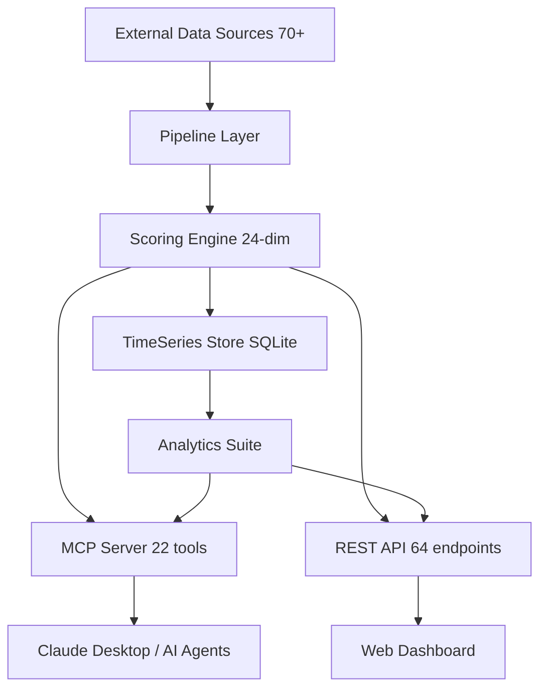

# SCRI Platform v0.5.1

**Supply Chain Risk Intelligence** -- 24-Dimension Passive Risk Detection Platform

A comprehensive, questionnaire-free supply chain risk assessment system that continuously monitors 70+ external data sources across 24 risk dimensions. Designed for Japanese procurement teams to evaluate and monitor global supplier risk with real-time evidence.

---

## Architecture



### Component Overview

| Layer | Component | Description |
|-------|-----------|-------------|
| Data Ingestion | Pipeline Layer | 70+ external API connectors with caching and retry logic |
| Scoring | Engine (24-dim) | Weighted composite scoring with peak risk amplification |
| Interface | MCP Server | 22 tools for Claude Desktop / AI agent integration |
| Interface | REST API | 64 FastAPI endpoints for web dashboard and programmatic access |
| Storage | TimeSeries Store | SQLite-based historical score tracking for trend analysis |
| Analysis | Analytics Suite | Portfolio, Correlation, Benchmark, Sensitivity analytics |

---

## Data Sources (70+)

### Sanctions & Compliance (16 sources)

| Source | Coverage | Update Frequency | API Key Required |
|--------|----------|-------------------|-----------------|
| OFAC SDN | US sanctions list | Daily | No |
| EU Sanctions | European Union consolidated list | Daily | No |
| UN Sanctions | UN Security Council sanctions | Daily | No |
| OpenSanctions | Aggregated global sanctions | Daily | No |
| METI End-User List | Japan export control | Weekly | No |
| BIS Entity List | US export control | Weekly | No |
| OFSI | UK financial sanctions | Daily | No |
| SECO | Switzerland sanctions | Daily | No |
| Canada DFATD | Canadian sanctions | Weekly | No |
| DFAT Australia | Australian sanctions | Weekly | No |
| MOFA Japan | Japan foreign affairs sanctions | Weekly | No |
| FATF | AML/CFT country assessments | Quarterly | No |
| INFORM Risk Index | Multi-hazard risk index | Annual | No |
| TI CPI | Corruption perception index | Annual | No |
| Freedom House | Political freedom ratings | Annual | No |
| Fragile States Index | State fragility rankings | Annual | No |

### Geopolitical & Conflict (2 sources)

| Source | Coverage | Update Frequency | API Key Required |
|--------|----------|-------------------|-----------------|
| GDELT BigQuery | Global event monitoring | Real-time (15-min) | Yes (GCP) |
| ACLED | Armed conflict & political violence | Weekly | Yes |

### Disaster & Natural Hazards (5 sources)

| Source | Coverage | Update Frequency | API Key Required |
|--------|----------|-------------------|-----------------|
| GDACS | Global disaster alerts | Real-time | No |
| USGS Earthquake | Global seismic activity | Real-time | No |
| NASA FIRMS | Active fire detection | Real-time | Yes |
| JMA | Japan Meteorological Agency | Real-time | No |
| BMKG | Indonesia meteorological agency | Real-time | No |

### Maritime & Transport (3 sources)

| Source | Coverage | Update Frequency | API Key Required |
|--------|----------|-------------------|-----------------|
| IMF PortWatch | Port disruption monitoring | Daily | No |
| AISHub | Vessel tracking (AIS data) | Real-time | Yes |
| UNCTAD Port Statistics | Port congestion metrics | Monthly | No |

### Economic & Trade (3 sources)

| Source | Coverage | Update Frequency | API Key Required |
|--------|----------|-------------------|-----------------|
| World Bank | GDP, inflation, macro indicators | Quarterly | No |
| Frankfurter/ECB | Currency exchange rates | Daily | No |
| UN Comtrade | International trade statistics | Monthly | No |

### Health & Humanitarian (3 sources)

| Source | Coverage | Update Frequency | API Key Required |
|--------|----------|-------------------|-----------------|
| Disease.sh | COVID-19 & epidemic tracking | Daily | No |
| ReliefWeb/OCHA | Humanitarian crisis reports | Daily | No |
| WFP HungerMap | Food security alerts | Weekly | No |

### Weather & Climate (6 sources)

| Source | Coverage | Update Frequency | API Key Required |
|--------|----------|-------------------|-----------------|
| Open-Meteo | Global weather forecasts | Hourly | No |
| NOAA NHC | Tropical cyclone tracking | Real-time | No |
| NOAA SWPC | Space weather / solar storms | Real-time | No |
| ND-GAIN | Climate vulnerability index | Annual | No |
| GloFAS | Global flood awareness | Daily | No |
| WRI Aqueduct | Water risk atlas | Annual | No |

### Environmental (1 source)

| Source | Coverage | Update Frequency | API Key Required |
|--------|----------|-------------------|-----------------|
| Climate TRACE | GHG emissions tracking | Annual | No |

### Labor & Human Rights (3 sources)

| Source | Coverage | Update Frequency | API Key Required |
|--------|----------|-------------------|-----------------|
| DoL ILAB | Child/forced labor goods list | Annual | No |
| Global Slavery Index | Modern slavery estimates | Biennial | No |
| ILOSTAT | Labor statistics | Quarterly | No |

### Infrastructure & Cyber (5 sources)

| Source | Coverage | Update Frequency | API Key Required |
|--------|----------|-------------------|-----------------|
| Cloudflare Radar | Internet traffic health | Real-time | Yes |
| IODA | Internet outage detection | Real-time | No |
| OONI | Internet censorship probing | Daily | No |
| CISA KEV | Known exploited vulnerabilities | Daily | No |
| ITU ICT | ICT development index | Annual | No |

### Aviation & Energy (3 sources)

| Source | Coverage | Update Frequency | API Key Required |
|--------|----------|-------------------|-----------------|
| OpenSky Network | Global flight tracking | Real-time | No |
| FRED | Federal Reserve economic data | Daily | Yes |
| EIA | Energy information | Weekly | No |

### Japan-Specific (3 sources)

| Source | Coverage | Update Frequency | API Key Required |
|--------|----------|-------------------|-----------------|
| BOJ | Bank of Japan statistics | Monthly | No |
| ExchangeRate-API | JPY exchange rates | Daily | No |
| e-Stat | Japan government statistics | Monthly | No |

### Regional Statistics (9 sources)

| Source | Coverage | Update Frequency | API Key Required |
|--------|----------|-------------------|-----------------|
| KOSIS | South Korea statistics | Monthly | No |
| Taiwan DGBAS | Taiwan statistics | Monthly | No |
| China NBS | China National Bureau of Statistics | Monthly | No |
| Vietnam GSO | Vietnam statistics | Quarterly | No |
| DOSM Malaysia | Malaysia statistics | Quarterly | No |
| MPA Singapore | Singapore maritime | Monthly | No |
| ASEAN Stats | ASEAN economic data | Quarterly | No |
| Eurostat | European Union statistics | Monthly | No |
| AfDB | African Development Bank data | Quarterly | No |

---

## Risk Dimensions (24)

### Category A: Sanctions, Conflict & Geopolitics (28% weight)

| # | Dimension | Key | Weight | Data Sources | Description |
|---|-----------|-----|--------|--------------|-------------|
| 1 | Sanctions Screening | sanctions | Override (100=block) | OFAC, EU, UN, OpenSanctions, METI, BIS, OFSI, SECO, Canada, DFAT, MOFA | Match against 11 global sanctions lists; 100 = confirmed match (auto-blocks) |
| 2 | Geopolitical Risk | geo_risk | 0.07 | GDELT | Event-based geopolitical tension monitoring |
| 3 | Conflict | conflict | 0.09 | ACLED | Armed conflict events, political violence, protests |
| 4 | Political Risk | political | 0.06 | Freedom House, FSI | Political freedom ratings, state fragility |
| 5 | Compliance | compliance | 0.06 | FATF, INFORM, TI-CPI | AML/CFT ratings, corruption perception, multi-hazard risk |

### Category B: Disaster, Infrastructure & Climate (26% weight)

| # | Dimension | Key | Weight | Data Sources | Description |
|---|-----------|-----|--------|--------------|-------------|
| 6 | Disaster | disaster | 0.07 | GDACS, USGS, FIRMS, JMA, BMKG | Active disasters, earthquakes, wildfires |
| 7 | Weather | weather | 0.04 | Open-Meteo | Extreme weather events, temperature anomalies |
| 8 | Typhoon & Space Weather | typhoon | 0.03 | NOAA NHC, NOAA SWPC | Tropical cyclones, solar storms, geomagnetic activity |
| 9 | Maritime | maritime | 0.04 | IMF PortWatch | Port disruptions, shipping lane blockages |
| 10 | Internet Infrastructure | internet | 0.03 | Cloudflare Radar, IODA | Internet outages, connectivity disruptions |
| 11 | Climate Risk | climate_risk | 0.05 | ND-GAIN, GloFAS, WRI Aqueduct, Climate TRACE | Long-term climate vulnerability, flood risk, emissions |

### Category C: Economic & Trade (23% weight)

| # | Dimension | Key | Weight | Data Sources | Description |
|---|-----------|-----|--------|--------------|-------------|
| 12 | Economic | economic | 0.06 | World Bank | GDP growth, inflation, debt, macro indicators |
| 13 | Currency | currency | 0.04 | Frankfurter/ECB | Exchange rate volatility, depreciation risk |
| 14 | Trade Dependency | trade | 0.05 | UN Comtrade | Import/export concentration, trade partner dependency |
| 15 | Energy | energy | 0.04 | FRED, EIA | Commodity prices (oil, gas, coal) and energy supply risk |
| 16 | Port Congestion | port_congestion | 0.04 | UNCTAD | Port waiting times, vessel turnaround, throughput |

### Category D: Cyber, Health & Other (23% weight)

| # | Dimension | Key | Weight | Data Sources | Description |
|---|-----------|-----|--------|--------------|-------------|
| 17 | Cyber Risk | cyber_risk | 0.04 | OONI, CISA KEV, ITU ICT | Internet censorship, known vulnerabilities, ICT development |
| 18 | Legal | legal | 0.04 | Caselaw MCP | Litigation history, legal proceedings |
| 19 | Health (Pandemic) | health | 0.04 | Disease.sh | COVID-19, epidemic tracking |
| 20 | Humanitarian Crisis | humanitarian | 0.03 | OCHA FTS, ReliefWeb | Humanitarian emergencies, displacement |
| 21 | Food Security | food_security | 0.03 | FEWS NET, WFP | Famine risk, food price volatility |
| 22 | Labor Risk | labor | 0.03 | DoL ILAB, GSI, ILOSTAT | Forced labor, child labor, labor rights |
| 23 | Aviation | aviation | 0.02 | OpenSky Network | Air traffic disruptions, flight cancellations |
| 24 | Japan Economy | japan_economy | Informational | BOJ, ExchangeRate-API, e-Stat | JPY exchange rates, economic indicators (not in overall) |

---

## Scoring Formula

### Composite Score Calculation

```
IF sanctions_score == 100:
    overall_score = 100  (immediate block)

ELSE:
    weighted_sum = SUM(dimension_score * weight) for all 22 weighted dimensions
    peak = highest dimension score
    second_peak = second highest dimension score

    composite = weighted_sum * 0.60 + peak * 0.30 + second_peak * 0.10

    IF sanctions_score > 0:
        composite = min(100, composite + sanctions_score / 2)

    overall_score = min(100, composite)
```

### Risk Levels

| Level | Score Range | Action |
|-------|------------|--------|
| CRITICAL | 80-100 | Immediate review required |
| HIGH | 60-79 | Enhanced monitoring |
| MEDIUM | 40-59 | Standard monitoring |
| LOW | 20-39 | Routine review |
| MINIMAL | 0-19 | No action needed |

### Design Rationale

- **60% Weighted Average**: Ensures all dimensions contribute proportionally
- **30% Peak Risk**: A single critical risk dimension elevates the overall score
- **10% Second Peak**: Compound risk (two high dimensions) is captured
- **Sanctions Override**: A confirmed sanctions match (score=100) immediately sets overall to 100
- **Japan Economy**: Informational only -- not included in composite calculation

---

## Analytics Features

### Portfolio Analysis
Batch analysis of multiple suppliers with risk ranking, geographic concentration assessment, and k-means clustering for risk-based grouping. Identify portfolio-level vulnerabilities across all 24 dimensions.

### Correlation Analysis
Compute Pearson/Spearman correlation matrices across risk dimensions and locations. Identify high-correlation pairs, detect risk cascades, and find leading indicators using time-series cross-correlation with configurable lag windows.

### Benchmark Analysis
Compare entity risk profiles against industry averages and peer groups. Provides percentile rankings across each dimension and computes regional baselines for relative assessment.

### Sensitivity Analysis
Weight perturbation testing to identify which dimensions most influence overall scores. Includes What-If scenario simulation (override dimension scores), threshold driver analysis, and Monte Carlo simulation for score distribution.

---

## MCP Tools Quick Reference (22 tools)

| # | Tool | Description |
|---|------|-------------|
| 1 | `screen_sanctions` | Screen entity against 11 sanctions lists |
| 2 | `monitor_supplier` | Register supplier for 15-min real-time monitoring |
| 3 | `get_risk_score` | Calculate 24-dimension supplier risk score |
| 4 | `get_location_risk` | Evaluate all risks for a specific location |
| 5 | `get_global_risk_dashboard` | Real-time global risk overview |
| 6 | `get_supply_chain_graph` | Build Tier-N supply chain network graph |
| 7 | `get_risk_alerts` | Retrieve recent risk alerts |
| 8 | `bulk_screen` | CSV bulk sanctions screening |
| 9 | `compare_locations` | Compare risk across multiple countries |
| 10 | `analyze_route_risk` | Transport route risk with chokepoint analysis |
| 11 | `get_concentration_risk` | Supplier concentration risk (HHI-based) |
| 12 | `simulate_disruption` | Supply chain disruption simulation |
| 13 | `generate_dd_report` | Auto-generate due diligence report |
| 14 | `get_commodity_exposure` | Sector-specific commodity exposure |
| 15 | `bulk_assess_suppliers` | CSV bulk assessment (sanctions + risk + concentration) |
| 16 | `get_data_quality_report` | Data quality and source health report |
| 17 | `analyze_portfolio` | Portfolio risk analysis with clustering |
| 18 | `analyze_risk_correlations` | Risk dimension correlation matrix |
| 19 | `find_leading_risk_indicators` | Leading indicator detection |
| 20 | `benchmark_risk_profile` | Industry and peer benchmarking |
| 21 | `analyze_score_sensitivity` | Weight sensitivity analysis |
| 22 | `simulate_what_if` | What-If scenario simulation |

---

## API Endpoints Summary (64 endpoints)

### Health (1)
| Method | Path | Description |
|--------|------|-------------|
| GET | `/health` | Health check with source status |

### Sanctions (2)
| Method | Path | Description |
|--------|------|-------------|
| POST | `/api/v1/screen` | Single entity screening |
| POST | `/api/v1/screen/bulk` | Bulk entity screening |

### Risk Scoring (1)
| Method | Path | Description |
|--------|------|-------------|
| GET | `/api/v1/risk/{supplier_id}` | 24-dimension risk score |

### Disasters (2)
| Method | Path | Description |
|--------|------|-------------|
| GET | `/api/v1/disasters/global` | GDACS global alerts |
| GET | `/api/v1/disasters/earthquakes` | USGS earthquake data |

### Maritime (4)
| Method | Path | Description |
|--------|------|-------------|
| GET | `/api/v1/maritime/disruptions` | Port disruption events |
| GET | `/api/v1/maritime/port-activity` | Port activity data |
| GET | `/api/v1/maritime/congestion/{region}` | Shipping lane congestion |
| GET | `/api/v1/maritime/port-congestion/{location}` | Port congestion metrics |

### Conflict (1)
| Method | Path | Description |
|--------|------|-------------|
| GET | `/api/v1/conflict/{location}` | ACLED conflict risk |

### Economic (5)
| Method | Path | Description |
|--------|------|-------------|
| GET | `/api/v1/economic/{location}` | Economic risk indicators |
| GET | `/api/v1/economic/profile/{location}` | Economic profile |
| GET | `/api/v1/currency/{location}` | Currency volatility |
| GET | `/api/v1/trade/{location}` | Trade dependency risk |
| GET | `/api/v1/energy/commodities` | Commodity prices |

### Health & Humanitarian (3)
| Method | Path | Description |
|--------|------|-------------|
| GET | `/api/v1/health/{location}` | Disease/pandemic risk |
| GET | `/api/v1/humanitarian/{location}` | Humanitarian crisis risk |
| GET | `/api/v1/food-security/{location}` | Food security risk |

### Weather (3)
| Method | Path | Description |
|--------|------|-------------|
| GET | `/api/v1/weather/{location}` | Weather risk |
| GET | `/api/v1/weather/typhoon/{location}` | Typhoon/cyclone risk |
| GET | `/api/v1/weather/space` | Space weather data |

### Compliance (3)
| Method | Path | Description |
|--------|------|-------------|
| GET | `/api/v1/compliance/{location}` | FATF/INFORM/TI-CPI |
| GET | `/api/v1/compliance/political/{location}` | Political risk |
| GET | `/api/v1/compliance/labor/{location}` | Labor risk |

### Infrastructure (1)
| Method | Path | Description |
|--------|------|-------------|
| GET | `/api/v1/infrastructure/internet/{location}` | Internet infrastructure risk |

### Aviation (1)
| Method | Path | Description |
|--------|------|-------------|
| GET | `/api/v1/aviation/{location}` | Aviation activity risk |

### Japan (1)
| Method | Path | Description |
|--------|------|-------------|
| GET | `/api/v1/japan/economy` | Japan economic indicators |

### Dashboard (1)
| Method | Path | Description |
|--------|------|-------------|
| GET | `/api/v1/dashboard/global` | Global risk dashboard |

### Alerts (1)
| Method | Path | Description |
|--------|------|-------------|
| GET | `/api/v1/alerts` | Risk alert list |

### Monitoring (3)
| Method | Path | Description |
|--------|------|-------------|
| POST | `/api/v1/monitor` | Register supplier monitoring |
| GET | `/api/v1/monitors` | List monitored suppliers |
| GET | `/api/v1/monitoring/quality` | Data quality dashboard |

### Stats (1)
| Method | Path | Description |
|--------|------|-------------|
| GET | `/api/v1/stats` | DB statistics |

### Graph (1)
| Method | Path | Description |
|--------|------|-------------|
| GET | `/api/v1/graph/{company_name}` | Supply chain graph |

### Route Risk (3)
| Method | Path | Description |
|--------|------|-------------|
| POST | `/api/v1/route-risk` | Route risk analysis |
| GET | `/api/v1/chokepoints` | List 7 chokepoints |
| GET | `/api/v1/chokepoint/{chokepoint_id}` | Chokepoint detail |

### Concentration (1)
| Method | Path | Description |
|--------|------|-------------|
| POST | `/api/v1/concentration` | Concentration risk analysis |

### Simulation (1)
| Method | Path | Description |
|--------|------|-------------|
| GET | `/api/v1/simulate/{scenario}` | Disruption simulation |

### DD Reports (1)
| Method | Path | Description |
|--------|------|-------------|
| POST | `/api/v1/dd-report` | Due diligence report |

### Commodity (1)
| Method | Path | Description |
|--------|------|-------------|
| GET | `/api/v1/commodity/{sector}` | Commodity exposure |

### Bulk Assessment (1)
| Method | Path | Description |
|--------|------|-------------|
| POST | `/api/v1/bulk-assess` | Bulk supplier assessment |

### Climate (1)
| Method | Path | Description |
|--------|------|-------------|
| GET | `/api/v1/climate/{location}` | Climate risk |

### Cyber (1)
| Method | Path | Description |
|--------|------|-------------|
| GET | `/api/v1/cyber/{location}` | Cyber risk |

### Analytics (12)
| Method | Path | Description |
|--------|------|-------------|
| GET | `/api/v1/analytics/overview` | Analytics index |
| POST | `/api/v1/analytics/portfolio` | Portfolio analysis |
| POST | `/api/v1/analytics/portfolio/rank` | Portfolio ranking |
| POST | `/api/v1/analytics/portfolio/cluster` | Portfolio clustering |
| POST | `/api/v1/analytics/correlations` | Correlation matrix |
| POST | `/api/v1/analytics/correlations/leading-indicators` | Leading indicators |
| GET | `/api/v1/analytics/correlations/cascades/{location}` | Risk cascades |
| POST | `/api/v1/analytics/benchmark/industry` | Industry benchmark |
| POST | `/api/v1/analytics/benchmark/peers` | Peer benchmark |
| GET | `/api/v1/analytics/benchmark/regional/{region}` | Regional baseline |
| POST | `/api/v1/analytics/sensitivity/weights` | Weight sensitivity |
| POST | `/api/v1/analytics/sensitivity/what-if` | What-If simulation |
| POST | `/api/v1/analytics/sensitivity/threshold` | Threshold drivers |
| POST | `/api/v1/analytics/sensitivity/montecarlo` | Monte Carlo simulation |

### UI (2)
| Method | Path | Description |
|--------|------|-------------|
| GET | `/` | Web UI index |
| -- | `/static/*` | Static file serving |

---

## Quick Start

### Installation

```bash
# Clone and setup
cd supply-chain-risk
python -m venv venv
source venv/bin/activate
pip install -r requirements.txt

# Initialize sanctions database
python scripts/ingest_sanctions.py

# Build baseline scores for 50 priority countries
python scripts/build_baseline_scores.py
```

### Run MCP Server (for Claude Desktop)

```bash
python mcp_server/server.py
# Server starts on http://localhost:8001 (SSE transport)
```

### Run REST API

```bash
uvicorn api.main:app --host 0.0.0.0 --port 8000 --reload
# API docs at http://localhost:8000/docs
```

### Claude Desktop Configuration

Add to `claude_desktop_config.json`:

```json
{
  "mcpServers": {
    "supply-chain-risk": {
      "command": "python",
      "args": ["mcp_server/server.py"],
      "transport": "sse",
      "url": "http://localhost:8001/sse"
    }
  }
}
```

### Generate Risk Heatmap

```bash
python scripts/generate_heatmap.py
# Output: reports/risk_heatmap.csv (50 countries x 24 dimensions)
```

---

## Monitored Countries (50)

Japan, United States, Germany, United Kingdom, France, Italy, Canada, China, India, Russia, Brazil, South Africa, Indonesia, Vietnam, Thailand, Malaysia, Singapore, Philippines, Myanmar, Cambodia, Saudi Arabia, UAE, Iran, Iraq, Turkey, Israel, Qatar, Yemen, South Korea, Taiwan, North Korea, Bangladesh, Pakistan, Sri Lanka, Nigeria, Ethiopia, Kenya, Egypt, South Sudan, Somalia, Ukraine, Poland, Netherlands, Switzerland, Mexico, Colombia, Venezuela, Argentina, Chile, Australia

---

*SCRI Platform v0.5.1 -- Built for Japanese procurement teams*
